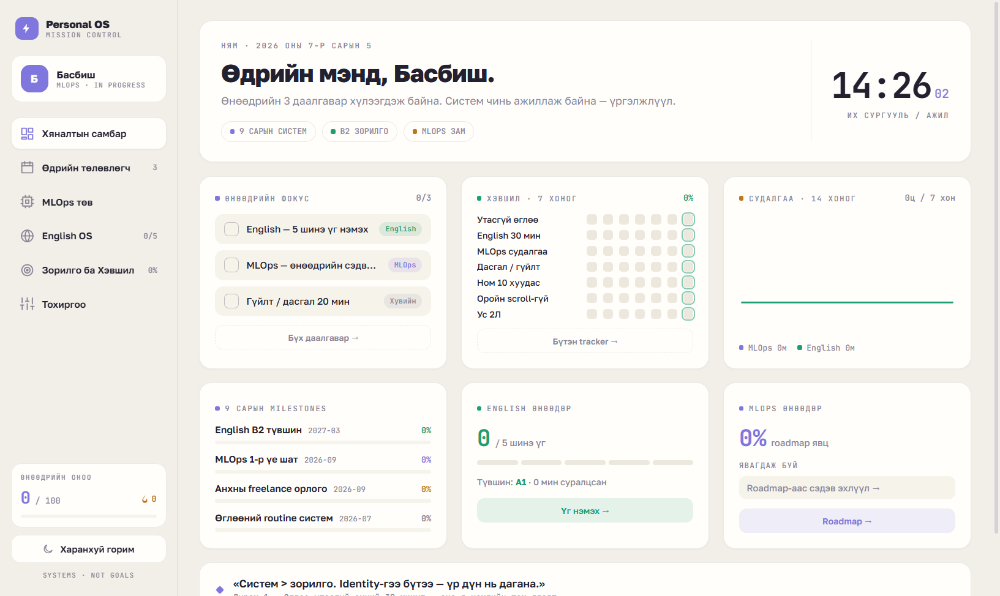
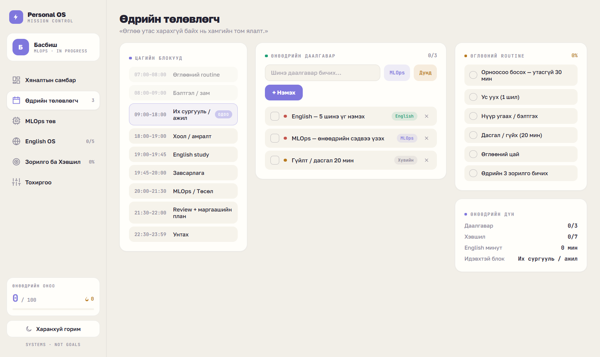
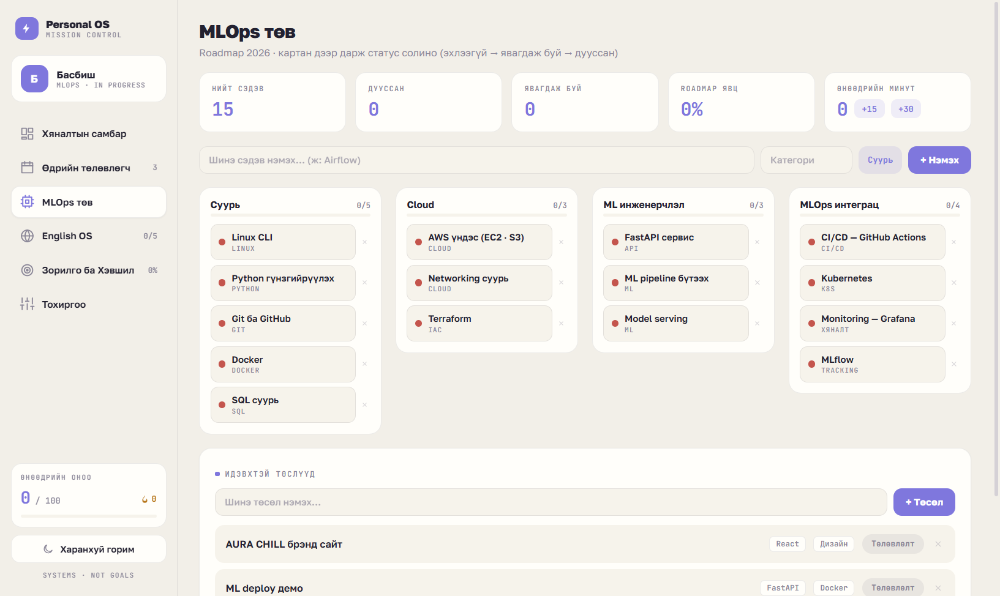
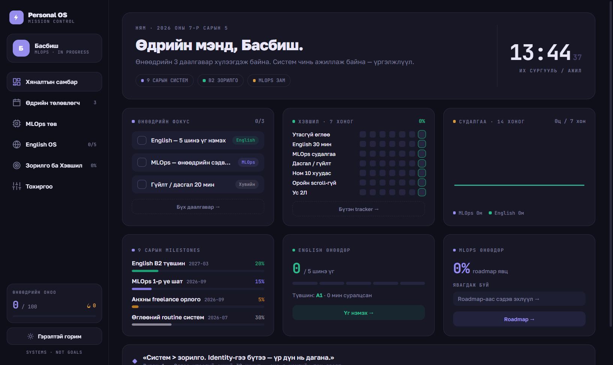
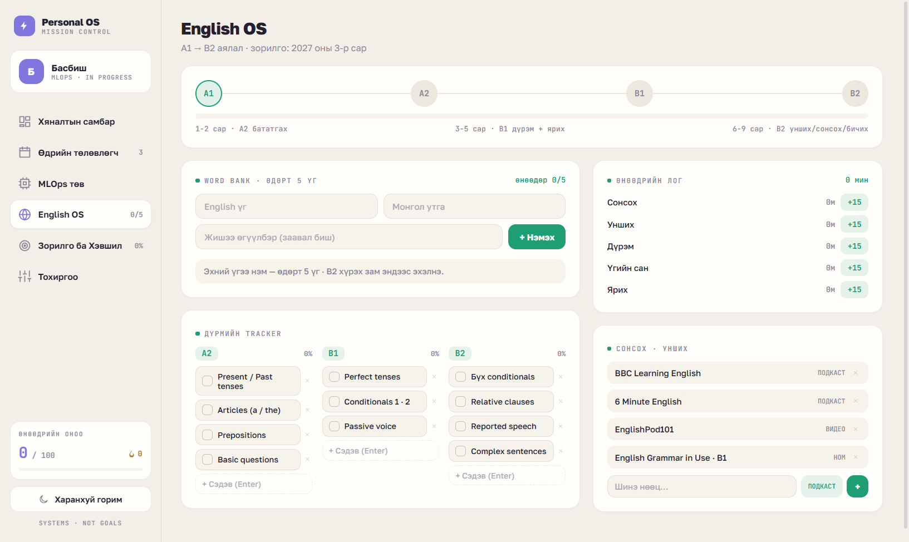
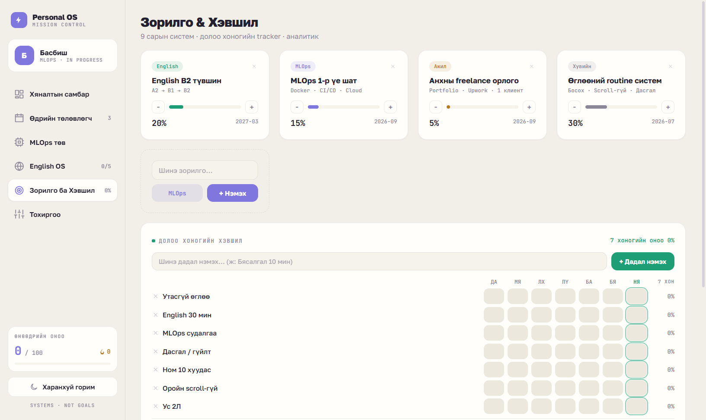
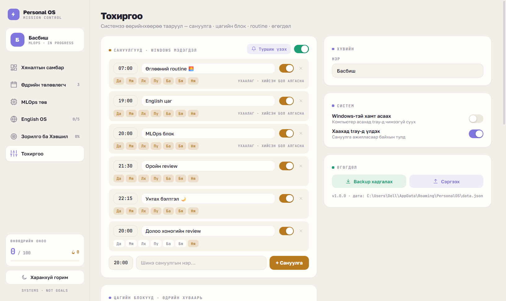
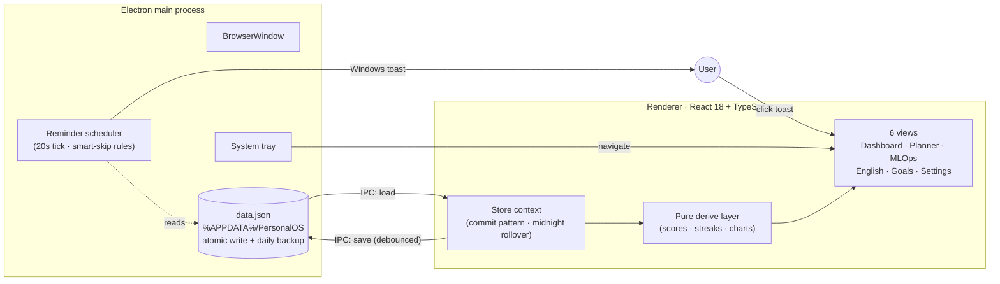

# ⚡ Personal OS

[](https://github.com/basababi/Personal-OS/actions/workflows/ci.yml)
[](LICENSE)


**A local-first personal operating system for Windows** — daily planner, habit tracker, MLOps learning roadmap, English  journey, and smart native reminders, living in your system tray.

Built with **Electron + React 18 + TypeScript + Vite**. All data stays on your machine — no accounts, no cloud, no telemetry.



## Why

I'm a university student on a 9-month mission: become an **MLOps engineer**, reach **English B2**, and build a consistent daily system. Generic to-do apps didn't cut it — I wanted a *mission control* built around my exact goals, that nudges me at the right time of day and turns my study minutes into real, honest analytics.

So I designed a hi-fi prototype and rebuilt it as a production desktop app. **The UI language is Mongolian** — it's my daily driver ([Mongolian README](README.mn.md)).

## Features

- 🗓 **Daily planner** — time blocks with a live "NOW" indicator, tasks with area/priority, morning routine checklist, overdue carry-over
- 🔥 **Habit tracker** — weekly grid, streaks, day scores, dynamic habits (add/remove any habit)
- 🧠 **MLOps roadmap** — 4-phase kanban (Foundation → Cloud → ML Engineering → MLOps), click-to-cycle topic status, projects board
- 🇬🇧 **English OS** — A1→B2 level stepper, word bank (5 words/day), grammar tracker, study-minutes log
- 📊 **Real analytics** — 14-day study charts, weekly habit trends, and a time-allocation donut, all computed from **actual logged history** (no demo data)
- 🔔 **Smart native reminders** — Windows toast notifications for each time block; a reminder *skips itself* if you've already done the thing (e.g. 30+ min of English logged)
- 🖥 **System tray app** — closes to tray, keeps reminding; quick navigation from the tray menu; optional launch-at-startup
- 💾 **Local-first data** — single JSON file in `%APPDATA%`, atomic writes, daily automatic backup, one-click export/import
- 🌗 **Light/dark themes**, fully offline (fonts bundled), pixel-faithful to the original design tokens

| Planner | MLOps Hub | Dark mode |
|---|---|---|
|  |  |  |

| English OS | Goals & Habits | Settings |
|---|---|---|
|  |  |  |

## Architecture



Key decisions:

- **`contextIsolation` + typed preload bridge** — the renderer never touches Node APIs; a small `window.pos` API surface handles persistence, dialogs, and auto-launch
- **Pure logic layer** ([src/lib](src/lib)) — date math, day/week rollover, streaks and scores are framework-free pure functions → trivially unit-tested
- **Commit pattern** — views mutate a single state tree and call `commit()`, which re-renders and debounce-persists; the main process keeps a cache of the last save so the reminder scheduler can apply smart-skip rules without waking the renderer
- **Honest data** — charts read from an append-only per-day history that the midnight rollover writes; nothing is faked
- **90-day history retention**, 8-week habit trend window, schema migration (`migrate()`) for forward compatibility

## Getting started

**Download:** grab the installer from [Releases](https://github.com/basababi/Personal-OS/releases) *(built by CI from tags)*.

**Run from source:**

```bash
npm install
npm run build     # bundle renderer → dist/
npm start         # launch Electron
```

**Develop:**

```bash
npm run dev        # Vite dev server (UI in browser)
npm test           # Vitest unit tests (date/rollover/streak logic)
npm run typecheck  # strict TypeScript
npm run shot       # capture screenshots of every view → shots/
npm run dist       # build NSIS installer → release/
```

## CI/CD

Every push runs **typecheck → unit tests → renderer build → installer package** on `windows-latest` ([workflow](.github/workflows/ci.yml)). Pushing a `v*` tag publishes the NSIS installer to GitHub Releases automatically:

```bash
git tag v1.0.0 && git push origin v1.0.0
```

## Data & privacy

Everything lives in `%APPDATA%\PersonalOS\data.json` (schema v2). The app writes atomically, keeps a daily `data.backup.json`, and Settings offers JSON export/import. No network calls at runtime.

## Roadmap

- [ ] SM-2 spaced repetition for the word bank
- [ ] AI morning briefing & weekly review drafts (Claude API)
- [ ] SQLite event log + FastAPI/Docker insights service (dogfooding my own MLOps roadmap)
- [ ] Global quick-capture hotkey

---

*Systems, not goals.* 🚀
